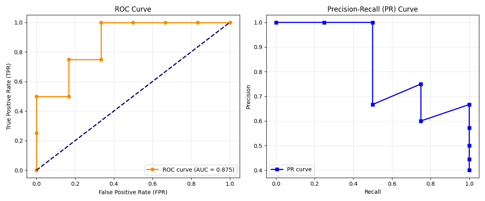

# 机器学习作业：ROC、PR与AUC计算

## 一、 数据基础信息
* **样本总数**：10 (正样本: 4个, 负样本: 6个)

## 二、 手动计算详细过程
| 阈值    | TPR  | FPR  | Precision | Recall |
| :------ | :--- | :--- | :-------- | :----- |
| >= 0.90 | 0.25 | 0.00 | 1.00      | 0.25   |
| >= 0.70 | 0.50 | 0.00 | 1.00      | 0.50   |
| >= 0.65 | 0.50 | 0.17 | 0.67      | 0.50   |
| >= 0.60 | 0.75 | 0.17 | 0.75      | 0.75   |
| >= 0.50 | 0.75 | 0.33 | 0.60      | 0.75   |
| >= 0.42 | 1.00 | 0.33 | 0.67      | 1.00   |
| >= 0.41 | 1.00 | 0.50 | 0.57      | 1.00   |
| >= 0.40 | 1.00 | 0.67 | 0.50      | 1.00   |
| >= 0.35 | 1.00 | 0.83 | 0.44      | 1.00   |
| >= 0.20 | 1.00 | 1.00 | 0.40      | 1.00   |

## 三、 最终结果
* 计算得出的 **ROC AUC 值：0.875**

## 四、 曲线图展示
