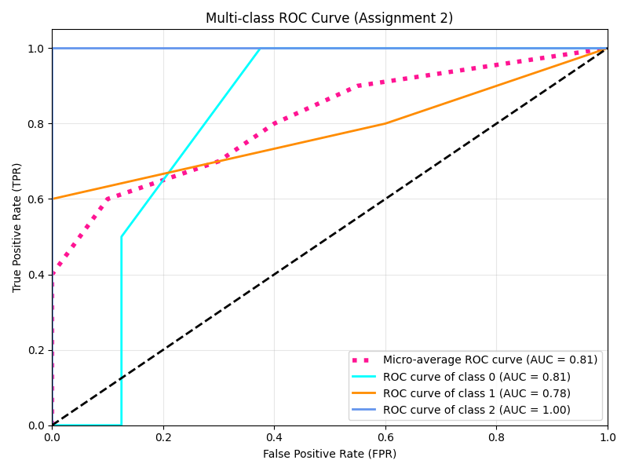

# Assignment 2: 多分类 ROC 曲线与 AUC 计算

## 一、 实验原理
本实验处理的是 3 分类问题（共 10 个样本）。由于标准 ROC 曲线适用于二分类，本实验采用 **“一对多 (One-vs-Rest)”** 策略：
1. 依次将 Class 0, Class 1, Class 2 视为正例，其余类别视为反例，计算出 3 条独立的 ROC 曲线。
2. 将所有样本的真实标签和预测概率展平，计算全局的 **微平均 (Micro-average)** 指标，作为综合评估曲线。

## 二、 AUC 计算真实结果
根据代码运行与图表绘制，最终得到的 AUC 数值如下：
* **Class 0 AUC**：0.81
* **Class 1 AUC**：0.78
* **Class 2 AUC**：1.00
* **总体微平均 (Micro-average) AUC**：0.81

> **结果分析**：模型对 Class 2 的预测极为准确（AUC=1.00），没有出现任何误判。对 Class 1 的预测效果相对最弱。整体模型的 Micro-average AUC 为 0.81，表现良好。

## 三、 ROC 曲线图展示
*(包含了 3 个类别的独立曲线与 1 条微平均曲线)*

